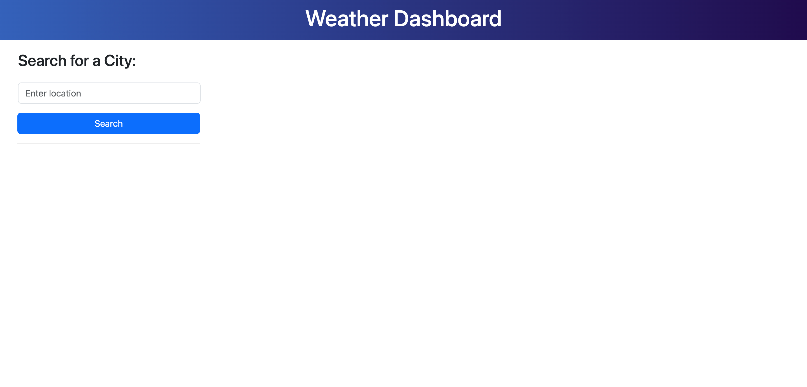
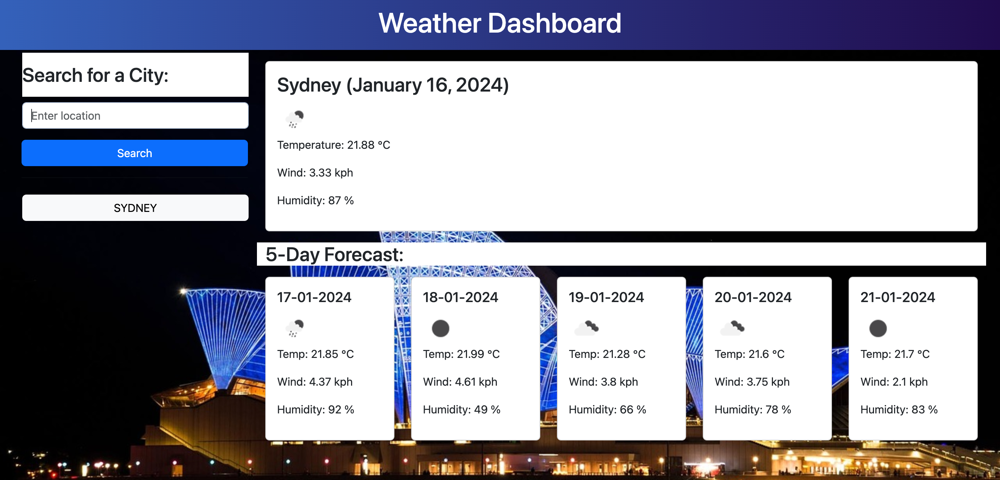
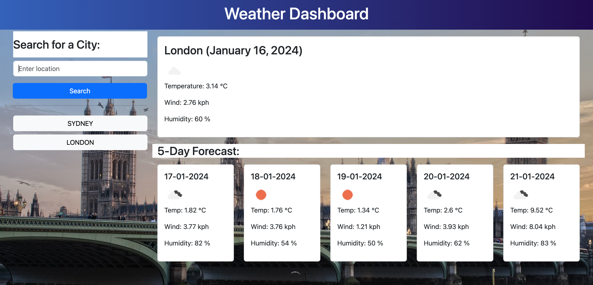
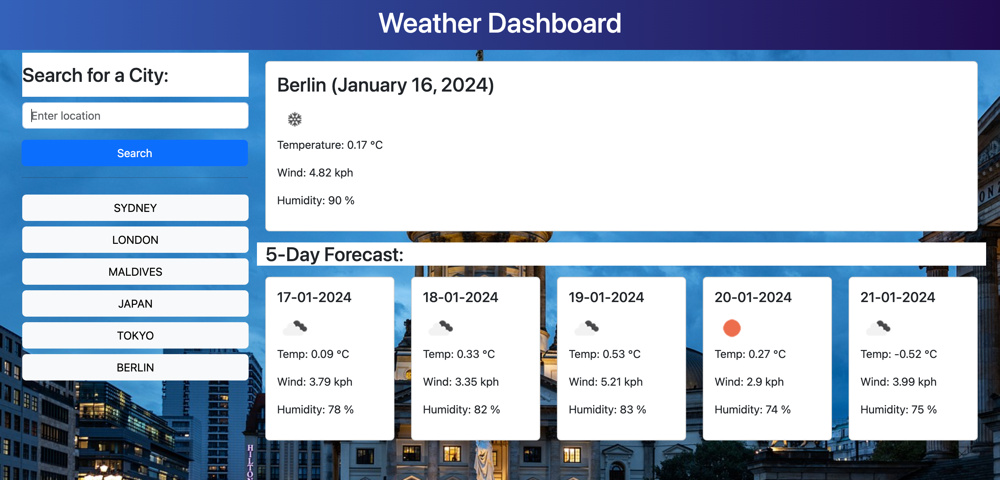
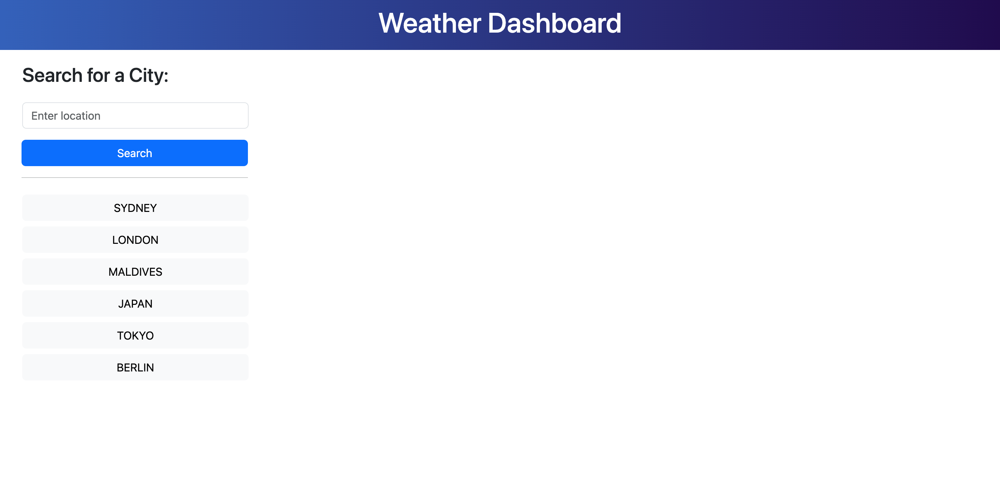

# Weather Dashboard

Challenge 8 - A weather dashboard which displays the current weather and 5-day forecast of a given location 

## Description

This weather dashboard showcases the jQuery, JavaScript, 3rd party API, Bootstrap, CSS & HTML skills I have gained from Module 8 (Server APIs) of the Front-end Web Development Bootcamp. 

This weather dashboard will run in the browser and feature dynamically updated HTML and CSS powered by **Bootstrap**, **jQuery**, **Day.js** and data from the [**Open Weather Map API**](https://openweathermap.org/api) and [**Pixabay API**](https://pixabay.com/api/docs/)

## Usage

1. The **Weather Dashboard** can be accessed online on Github pages: [https://jilloreilly.github.io/weather-dashboard/](https://jilloreilly.github.io/weather-dashboard/) and the repo can be found: [https://github.com/jilloreilly/weather-dashboard](https://github.com/jilloreilly/weather-dashboard)

2. The user can enter a location in the search form

3. The current weather for the given location (Name, date, weather icon, temperature(°C), wind speed(kph) and humidity(%)) is displayed as well as the 5-day forecast (Weather data provided by Open Weather Map API). The background image will display an image from the searched location. (Image provided by Pixabay API).

4. When a new location is entered, the current weather and 5-day forecast will be displayed. A button will appear in the search history underneath the search form

5. The search history for previously searched locations are displayed beneath the search form. Clicking on these buttons will reload the weather data for that location

6. The search history is saved to localstorage, thus on page load, the search history will be displayed on the page.
 
 
 

## Credits

Thank you to the following:

- jQuery:
  - [API](https://api.jquery.com/)
  - [.each](https://api.jquery.com/each/)

- w3Schools:
  - [JavaScript Array includes()](https://www.w3schools.com/js/js_array_search.asp#mark_includes)

  - Bootstrap documentation:
    - [Buttons](https://getbootstrap.com/docs/4.0/components/buttons/) 
    - [Forms](https://getbootstrap.com/docs/4.0/components/forms/)

 - [CSS Gradient Generator](https://cssgradient.io/)   

- [DayJs documentation for formatting time](https://day.js.org/docs/en/display/format)

- Pod 2 TA **Christopher Kratz** for guiding us on the Javascript for the challenge

- My tutor **Cody Junier** for helping me resolve an issue of duplicate search entries by utilising the .includes() method on the searchHistory array in localstorage

- **Sarah Egleston** from Pod 2 for recommending the [Pixabay API](https://pixabay.com/api/docs/) for location images 

- Icons8 for [favicon](https://icons8.com/icons/set/schedule)

## License

MIT License

Copyright (c) 2023 Jill O'Reilly

Permission is hereby granted, free of charge, to any person obtaining a copy
of this software and associated documentation files (the "Software"), to deal
in the Software without restriction, including without limitation the rights
to use, copy, modify, merge, publish, distribute, sublicense, and/or sell
copies of the Software, and to permit persons to whom the Software is
furnished to do so, subject to the following conditions:

The above copyright notice and this permission notice shall be included in all
copies or substantial portions of the Software.

THE SOFTWARE IS PROVIDED "AS IS", WITHOUT WARRANTY OF ANY KIND, EXPRESS OR
IMPLIED, INCLUDING BUT NOT LIMITED TO THE WARRANTIES OF MERCHANTABILITY,
FITNESS FOR A PARTICULAR PURPOSE AND NONINFRINGEMENT. IN NO EVENT SHALL THE
AUTHORS OR COPYRIGHT HOLDERS BE LIABLE FOR ANY CLAIM, DAMAGES OR OTHER
LIABILITY, WHETHER IN AN ACTION OF CONTRACT, TORT OR OTHERWISE, ARISING FROM,
OUT OF OR IN CONNECTION WITH THE SOFTWARE OR THE USE OR OTHER DEALINGS IN THE
SOFTWARE.

## Technologies Used

